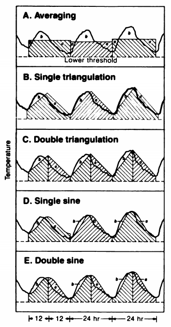
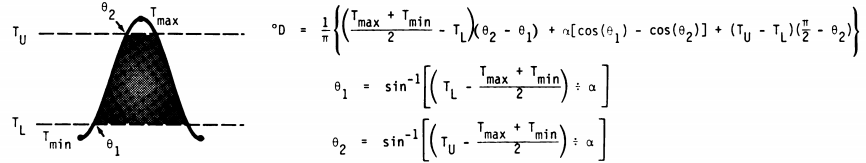
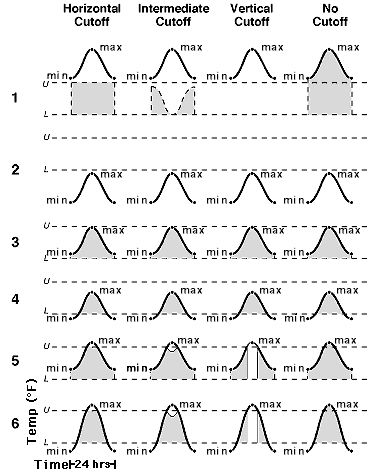

<!-- README.md is generated from README.Rmd. Please edit that file -->

```{r include = FALSE}
library(dplyr)
```


\

*The Degree Days Validation Challenge is an opportunity for researchers and computer programmers to validate and share their code that computes degree days.*

\

## Background

'Degree days' are a measure of accumulated heat. The concept was developed by biologists who realized that you can predict the growth of plants and insects by tallying the temperature each day, starting when they emerge. Today, degree day models are widely used in agriculture to predict crop growth and stages of insect pest development.

In practice, one computes degree days using hourly temperature data. In the event that hourly data are not available, one can also estimate degree days based on the daily minimum and maximum temperature. Several different forumula have been developed to estimate degree days from daily min and max temperature.

\

## Degree Day Estimation Formulas

There are several mathematical formula that can be used to estimate degree days based on daily minimum and maximum temperature. One of the earliest papers to publish formulas for the different methods was Zalom et al ([1983](https://catalog.hathitrust.org/Record/008707238)). 

  
*Zalom et al (1983) provide formula for different methods of estimating degree days based on daily minimum and maximum temperature*

<br/><br/>


*Sample equation for accumulated degree days for the single-sine method*

<br/>

Later authors developed variations of these formulas, including three types of cutoff methods: horizontal, vertical, and intermediate.



\

These formula have been used by researchers over the decades, and are the engine behind the Degree Day calculators on the [UC ANR Integrated Pest Management](http://ipm.ucanr.edu/WEATHER/) (UC IPM) website. 

\

## Validate Your Code

Numerous researchers and web developers have written computer code to compute degrees for specific applications, using programming languages such as Fortran, Python, R, JavaScript, Matlab, Perl, and others, etc. To check whether your code works as expected, all researchers are invited to run their code on the reference dataset below, and optionally share their code.

**Reference daily temperature dataset**

The reference temperature dataset contains 1 year of daily minimum and maximum temperature values (&#176;F) from the Esparto-A CIMIS weather station:

[espartoa-weather-2020.csv](https://raw.githubusercontent.com/UCANR-IGIS/degree-day-challenge/main/data/espartoa-weather-2020.csv)

\

Preview:

```{r}
library(dplyr)
daily_min_max_tbl = read.csv("./data/espartoa-weather-2020.csv")
nrow(daily_min_max_tbl)
daily_min_max_tbl %>% slice(1:10)
```

\

To check the validity of your code, you should compute degree days for this dataset with a **lower threshold of 50** and an **upper threshold of 70**. The reference dataset has tmin and tmax values that cover all six cases of relationship within this temperature range:

```{r}
thresh_low = 50
thresh_high = 70

## Case 1: tmin < thresh_low; tmax < thresh_low
case1 = sum(daily_min_max_tbl$tmin < thresh_low & 
      daily_min_max_tbl$tmax < thresh_low)
case1

## Case 2: tmin < thresh_low; tmax between thresh_low and thresh_high
case2 = sum(daily_min_max_tbl$tmin < thresh_low &
      daily_min_max_tbl$tmax >= thresh_low &
      daily_min_max_tbl$tmax <= thresh_high)
case2 

## Case 3: tmin between thresh_low and thresh_high; tmax between thresh_low and thresh_high
case3 = sum(daily_min_max_tbl$tmin >= thresh_low &
      daily_min_max_tbl$tmin <= thresh_high &
      daily_min_max_tbl$tmax >= thresh_low &
      daily_min_max_tbl$tmax <= thresh_high)
case3

## Case 4: tmin between thresh_low and thresh_high; tmax > thresh_high
case4 = sum(daily_min_max_tbl$tmin >= thresh_low &
      daily_min_max_tbl$tmin <= thresh_high &
      daily_min_max_tbl$tmax > thresh_high)
case4

## Case 5: min > thresh_high; tmax > thresh_high
case5 = sum(daily_min_max_tbl$tmin > thresh_high &
      daily_min_max_tbl$tmax > thresh_high)
case5

## Case 6: tmin < thresh_low; tmax > thresh_high
case6 = sum(daily_min_max_tbl$tmin < thresh_low &
      daily_min_max_tbl$tmax > thresh_high)
case6

## The cases should add up to the number of rows (366)
case1 + case2 + case3 + case4 + case5 + case6
```

# The Correct Answers

**TODO: need to add simple average method 1 and 2 (McMaster and Wilhelm, 1997)**

The results from the [UC IPM website](http://ipm.ucanr.edu/WEATHER/index.html) shall serve as the correct answers. The UC IPM website has been the reference for degree day calculations for decades, and they have all the major methods available. The correct answers have been compiled into a single CSV file:

[ucipm_low50_high70_all.csv](https://raw.githubusercontent.com/UCANR-IGIS/degree-day-challenge/main/data/ucipm_results/ucipm_low50_high70_all.csv)

\

Preview:

```{r}
answers_tbl = read.csv("./data/ucipm_results/ucipm_low50_high70_all.csv")
answers_tbl %>% slice(1:10)
```

\

To re-generate the correct answers, go to the [UC IPM website](http://ipm.ucanr.edu/WEATHER/index.html) and upload the version of the reference data that has [no headers](https://raw.githubusercontent.com/UCANR-IGIS/degree-day-challenge/main/data/espartoa-weather-2020-noheader.csv).

## Submit Your Degree Day Computations!

If you have gone through all the trouble of coding up the degree day formulas, you should get some credit for it! Let us know about your results by starting a [Github issue](https://github.com/UCANR-IGIS/degree-day-challenge/issues), and we will link them below. Your codes **doesn't have to support every single method**, but it should present the comparisons to the answers. If you're willing to share your code with others, please put enough description and links so others can replicate your work.

When your submission is posted, you'll be sent embed code to display the coveted **degree-day-challenge badge** on your site:


### Python

::: {style="margin-left:2em;"}
**Library**: **HeatUnits**  
**Author**: Shane Feirer   
**Code**: [HeatUnits.py](https://github.com/UCANR-IGIS/caladapt-py/blob/master/CookBooks/HeatUnits.py)  
**Notebook**: [DegreeDaysChallenge.ipynb](https://ucanr-igis.github.io/degree-day-challenge/submissions/heatunits_py/HeatUnits_py.html) ([HeatUnits_py.ipynb]())  

**Results**:

```{r echo = FALSE}
passing_grn <- "<span style='color:#14c700;'>passing</span>"
passing_org <- "<span style='color:#ed6a43;'>>95% passing</span>"
c(
"Single-sine (horizontal cutoff)", passing_grn, 
"Double-sine (horizontal cutoff)", passing_grn, 
"Single-triangle (horizontal cutoff)", passing_grn, 
"Double-triangle (horizontal cutoff)", passing_grn, 
"Single-sine (intermediate cutoff)", passing_org, 
"Double-sine (intermediate cutoff)", passing_org, 
"Single-triangle (intermediate cutoff)", passing_org, 
"Double-triangle (intermediate cutoff)", passing_org, 
"Single-sine (vertical cutoff)", passing_org, 
"Double-sine (vertical cutoff)", passing_org, 
"Single-triangle (vertical cutoff)", passing_org, 
"Double-triangle (vertical cutoff)", passing_org  
) |> 
  matrix(ncol = 2, byrow = TRUE) |> 
  as.data.frame() |> 
  setNames(c("Method", "Result")) |> 
  knitr::kable(format = "markdown")
```

:::

### R

::: {style="margin-left:2em;"}
**Library**: **degday**  
**Author**: Andy Lyons   
**Code**: [degday](https://ucanr-igis.github.io/degday/)  
**Notebook**: 
[Degree Day Validation Challenge with degday](https://ucanr-igis.github.io/degree-day-challenge/submissions/degday_r/degday_R.nb.html) ([degday_R.Rmd]())
**Results**: 

```{r echo = FALSE}
passing_grn <- "<span style='color:#14c700;'>passing</span>"
passing_org <- "<span style='color:#ed6a43;'>>95% passing</span>"
c(
"Single-sine (horizontal cutoff)", passing_grn, 
"Double-sine (horizontal cutoff)", passing_grn, 
"Single-triangle (horizontal cutoff)", passing_grn, 
"Double-triangle (horizontal cutoff)", passing_grn 
) |> 
  matrix(ncol = 2, byrow = TRUE) |> 
  as.data.frame() |> 
  setNames(c("Method", "Result")) |> 
  knitr::kable(format = "markdown")
```

:::

### JavaScript

*No submissions yet*

### Matlab

*No submissions yet*


